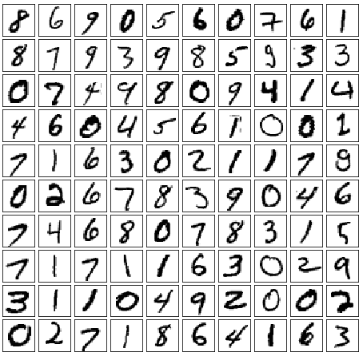
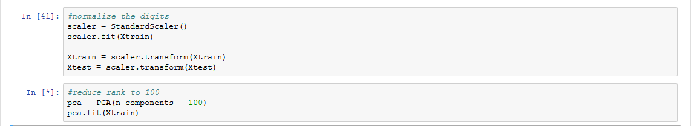
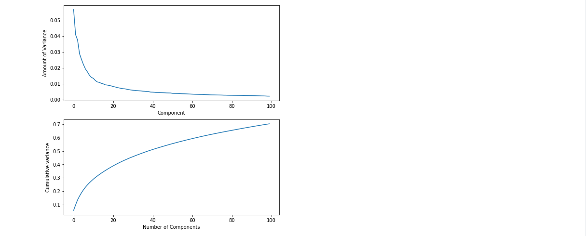
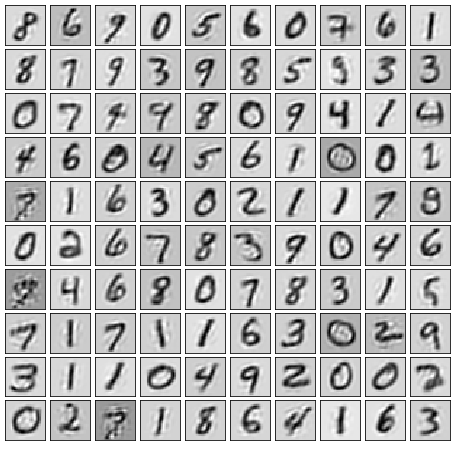
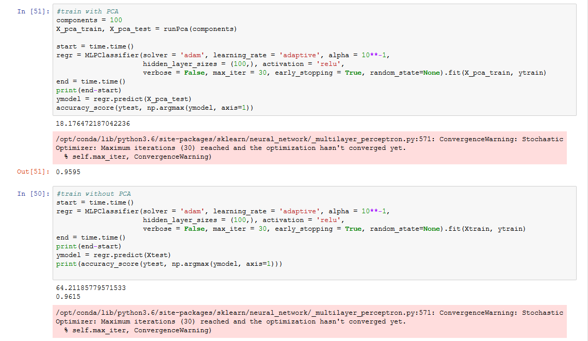

# DS Final
 Data Science Final Project

## Introduction
The objective of this project is to see the effects of dimensionality reduction on training neural networks, specifically to see the effects of dimensionality reduction on a MLPClassifier for recognizing handwritten digits and how dimensionality reduction can help with saving both space and time. 

## Data
We used the MNIST Handwritten data set. MNIST comes with 60,000 samples of 28x28 handwritten digits and an additional 10,000 samples as training data. Here are 100 samples of the training data set:

## Methods
Tools:
- Keras to import the MNIST data set
- Scikit-learn for the PCA dimensionality reduction and MLPClassifier training
- GitHub for version control
- Jupyter as IDE

Methods used within Scikit: 
- MLPClassifier model
- PCA
- StandardScaler

## Results
In order to use this data, however, we must format it into a 2 dimensional array. To do this, we turn each image into one long vector, leaving us with a training matrix of size (60000, 784). To perform our dimensionality reduction, we scale our data using StandardScaler and use the built-in sklearn PCA function. 

After fitting our data with the PCA method, we reduce the dimensions down to just 100 components. From the pca.explained_variance_ratio_ method, we see the first 100 components captures quite a lot of the variance over the entire training data set and the components are ordered from most variance to least:

To really see how good of an approximation the first 100 components are, we can inverse transform the components to get an approximation of the original dataset: 

So we see that the first 100 components actually captures the originial dataset quite well. We will also see that training MLPClassifers on these components will also yield almost identical results to training the MLPClassifier on the original dataset:

Where we see the reduced train and test set achieved an accuracy of 95.95% in about 18 seconds while our original train and test set achieved an accuracy of 96.15% in about 64 seconds. 

## Discussion
Dimensionality reduction is a great way to save time and resources if done correctly. Just because there is a large volume of data does not mean it is all useful or relevant to your objective. Here we show that just using about 1/8th of the total data we had, we can achieve an accuracy almost identical to a model using the full data set while taking a fraction of the time to train. 

We are interested in how these observations can generalize to other problems involving computer vision. PCA can be done on any data which can be made into a matrix, thus is extremely versatile in what kinds of data we can apply it to. Some more advanced topics might include Robust Principal Component Analysis, which can be used when observations are extremely corrupted. We could also look into convolutional neural networks to drastically increase the performance of our model. 

## Summary
This project shows how we can use PCA in order to reduce the time and space needed to train neural networks. We achieved almost the same accuracy with 100 components as we did with our original data set within a fraction of the time. 
